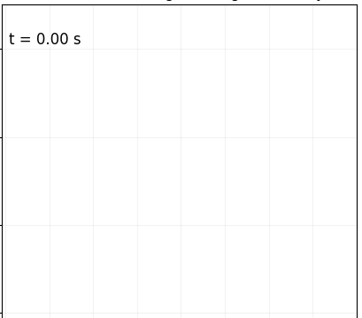

# Multi-Agent Drone Swarm — Safety-Critical Control

A 2D "drone show" simulator: a swarm of planar quadrotors flies from scrambled
starting positions into a target formation — spelling out a logo or
reconstructing an arbitrary image, pixel by pixel — while a **Control Barrier
Function (CBF)** safety filter provably keeps every pair of drones collision-free
along the way. Built for Caltech's CDS 233 (Safety-Critical Control).

<table>
<tr>
<td align="center"><br/><sub>heart</sub></td>
<td align="center"><br/><sub>bike</sub></td>
<td align="center"><br/><sub>flamingo</sub></td>
</tr>
</table>

Every one of these runs is the *same* controller and safety filter — only the
target image changes. A larger example (`flappy_bird.gif`, 35 MB) lives in
[`gifs/`](gifs/) but isn't embedded here to keep the page light.

## How it works

Each drone is a planar quadrotor with state $x = [p_x, p_y, \theta, \dot p_x,
\dot p_y, \dot\theta]$ and input $u = [u_1, u_2]$ (the two rotor thrusts),
evolving under the control-affine dynamics $\dot x = f(x) + g(x)u$. The
controller is a **cascade of three layers**, run centrally once per timestep
for the whole swarm:

```
target position  →  [ nominal controller ]  →  a_nom (2D accel)
                            ↓
                  [ centralized CBF-QP filter ]  →  a_safe (collision-free)
                            ↓
                  [ flatness / attitude loop ]  →  u1, u2 (rotor thrusts)
```

**1. Nominal controller — feedback linearization.**
Early versions ([`sim.py`](sim.py)) control a single hovering quadrotor by
exact input-output feedback linearization: inverting the actual $g(x)$ matrix
(`np.linalg.solve(G, ...)`) so the nonlinear system behaves like a linear one
in $(y,\theta)$. For the swarm, position tracking is instead posed on the
planning model of a 2D double integrator ($\ddot p = a$). Because the output
$y = p - p_{des}$ has *relative degree 2* here, a position-only Lyapunov
function has $L_g V = 0$ and is useless in an acceleration-level QP — so the
CLF is built on the output *and* its derivative, $\eta = [p - p_{des},\, v]$,
with $V(\eta) = \eta^\top P \eta$ where $P$ solves the CARE
$A^\top P + PA - PBR^{-1}B^\top P + Q = 0$. This gives a pointwise **min-norm
CLF-QP**:

$$\min_{a,\delta}\ \tfrac12\lVert a\rVert^2 + \tfrac12 p_{relax}\delta^2
\quad\text{s.t.}\quad L_fV + L_gV\,a \le -c\,V + \delta$$

which has a closed-form KKT solution ($a = -\mu\,L_gV$). Later files swap this
for an LQR feedforward on the same $\eta$ (equivalent gain, smoother in dense
swarms). Either way, the resulting acceleration is converted to thrusts via
the quadrotor's differential flatness: $T = m\sqrt{a_x^2+(a_y+g)^2}$,
$\theta_d = \text{atan2}(-a_x,\ a_y+g)$, tracked by a fast attitude PD loop —
this inner loop is itself an (approximate) feedback linearization of the tilt
dynamics, valid under time-scale separation from the slower translational loop.

**2. Safety filter — Control Barrier Functions.**
Collision avoidance is one pairwise barrier per drone pair:

$$h_{ij}(x) = \lVert p_i - p_j \rVert^2 - D_s^2 \ge 0$$

Since $u$ enters through acceleration, $h_{ij}$ also has relative degree 2, so
a single-derivative CBF condition doesn't apply directly — the filter instead
enforces the **exponential / high-order CBF** condition (poles at $-\alpha_1$
and $-\gamma$):

$$\ddot h_{ij} + (\alpha_1+\gamma)\,\dot h_{ij} + \alpha_1\gamma\, h_{ij} \ge 0$$

which expands (with $\Delta p = p_i-p_j,\ \Delta v = v_i-v_j$) to a constraint
that's *affine* in the two drones' accelerations:

$$2\Delta p\cdot a_i - 2\Delta p\cdot a_j \ \ge\ -2\lVert\Delta v\rVert^2 -2(\alpha_1+\gamma)\,\Delta p\cdot\Delta v -\alpha_1\gamma\left(\lVert\Delta p\rVert^2 - D_s^2\right)$$

Stacking one such constraint per pair gives the centralized **min-norm
safety-filter QP**, solved every timestep with `cvxpy` + OSQP:

$$\min_{a_1,\dots,a_N} \sum_i \lVert a_i - a_i^{nom}\rVert^2 \quad\text{s.t. the above, for every pair } i<j$$

i.e. the *least-restrictive* correction to the nominal command that keeps
every pair provably safe. A naive implementation is $O(N^2)$ constraints, so
[`drone_show_sprite.py`](drone_show_sprite.py) adds a sensing radius
$D_{sense}$ (only nearby pairs get a constraint), a warm-started `cvxpy`
`Parameter` problem (`WarmStartCBF`), and a hand-built sparse OSQP problem
(`SparseCBF`) that scales to swarms far larger than the original ~25 drones.

## Repository layout

The project evolved as a series of demos, each file mostly self-contained —
read them in this order to see the idea build up:

| File | What it adds |
|---|---|
| [`sim.py`](sim.py) | Baseline: independent quadrotors, no coordination. Exact feedback-linearizing hover controller. |
| [`multi_cbf_sim.py`](multi_cbf_sim.py), [`multi_cbf_int.py`](multi_cbf_int.py) | Introduces the centralized CBF-QP safety filter over a simple PD nominal controller. Head-on and 4-way intersection scenarios. |
| [`multi_cbf_clf_int.py`](multi_cbf_clf_int.py) | Replaces the PD nominal controller with the CARE-based CLF-QP. |
| [`drone_show.py`](drone_show.py) | First full "drone show": 25 drones spelling the Caltech "C" logo. |
| [`drone_show_clf_cbf.py`](drone_show_clf_cbf.py) | Drone show using the CLF-QP (+ LQR feedforward) nominal layer. |
| [`drone_show_sprite.py`](drone_show_sprite.py) | Full pipeline: load *any* image → one drone per opaque pixel, LQR nominal, warm-started/sparse CBF-QP, Hungarian-algorithm launch assignment, convergence-based early stop, GIF export. |

Sprites for `drone_show_sprite.py` are pre-rendered pixel-art PNGs in
[`figs/`](figs/) (one lit pixel = one drone).

## Running it

```bash
pip install numpy scipy matplotlib cvxpy osqp pillow
python drone_show_sprite.py
```

By default this flies the swarm into the `flappy_bird` sprite from `figs/`;
edit `sprite_path` at the bottom of `drone_show_sprite.py` to point at any of
the other pre-rendered images there instead.

## Acknowledgments

A team project for Caltech CDS 233 (Safety-Critical Control), built together
with [Deon Petrizzo](https://github.com/deonfpetrizzo) and Jawhara Emhemed.
