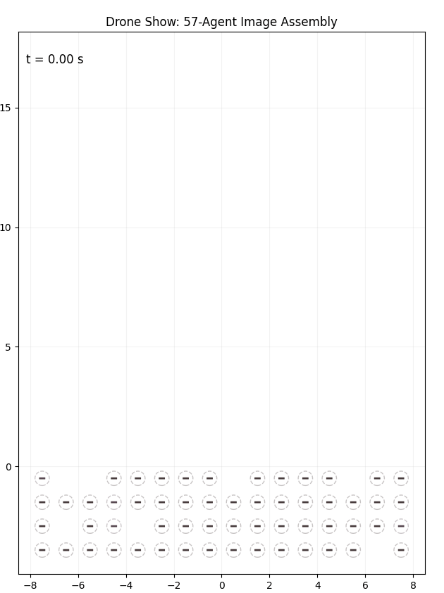
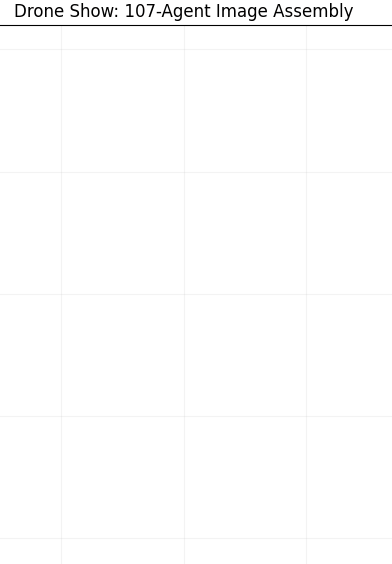

# Multi-Agent Drone Swarm — Safety-Critical Control

A 2D "drone show" simulator: give it any image, and a swarm of planar
quadrotors — one per lit pixel — flies from a scrambled launch grid into that
picture, while a centralized **Control Barrier Function (CBF)** safety filter
provably keeps every pair of drones collision-free the whole way there. Built
for Caltech's CDS 233 (Safety-Critical Control).

<p align="center">
  
  
</p>

## Overview

### System Modeling

Each of the $N$ agents is modeled as a **planar (2D) quadrotor**: position
$(x, y)$, tilt angle $\theta$, and two rotor thrusts $u_1, u_2$ as the control
input. The equations of motion are:

$$m\ddot{x} = -(u_1+u_2)\sin\theta$$

$$m\ddot{y} = (u_1+u_2)\cos\theta - mg$$

$$I\ddot{\theta} = r(u_1-u_2)$$

with mass $m$, moment of inertia $I$, half-span $r$, and gravity $g$. Written
as a state vector $z=(x,y,\theta,\dot x,\dot y,\dot\theta)$, this is a
control-affine system $\dot z = f(z) + g(z)u$ — the model every controller
and the safety filter below act on.

### Workflow

```
                                                target
                   ┌───────┐    ┌───────────────┐    ┌─────────────┐
                   │ image │───►│ pixel targets │───►│ LQR nominal │
                   └───────┘    └───────────────┘    └──────┬──────┘
                                                            │ a_nom
                                                            ▼
                 u1,u2                     a_safe
┌───────────────┐    ┌─────────────────────┐    ┌──────────────────────┐
│ rotor thrusts │◄───│ thrust/tilt mapping │◄───│ CBF-QP safety filter │
└───────────────┘    └─────────────────────┘    └──────────────────────┘
```

**Image → targets.** `load_sprite` turns every opaque, non-background pixel
of an input image into one drone's target `(x, y)`. One lit pixel = one
quadrotor — a 25×25 sprite means 625 agents, each with a pairwise safety
constraint against every other.

<p align="center">
  
  &nbsp;&nbsp;&nbsp;&nbsp;&nbsp;&nbsp;<b>&#10230;</b>&nbsp;&nbsp;&nbsp;&nbsp;&nbsp;&nbsp;
  
  &nbsp;&nbsp;&nbsp;&nbsp;&nbsp;&nbsp;<b>&#10230;</b>&nbsp;&nbsp;&nbsp;&nbsp;&nbsp;&nbsp;
  
</p>

<p align="center"><sub><i>original photo &nbsp;→&nbsp; pixelated sprite (one target per pixel) &nbsp;→&nbsp; 540 drones assembling it live</i></sub></p>

**Launch assignment.** Instead of a random scramble, `make_start_positions`
matches launch positions to targets with the Hungarian algorithm
(`scipy.optimize.linear_sum_assignment`), minimizing total travel distance
and cutting down on avoidable path crossings before the safety filter even
has to intervene.

**Nominal controller.** For planning, each drone is simplified to a 2D double
integrator on position $p=(x,y)$:

$$\dot p = v, \qquad \dot v = a$$

Tracking is posed on the error state $\eta = (p - p_{des},\, v)$, and
`lqr_control` applies the fixed LQR-optimal gain $K$ (solved once offline
from this double-integrator model):

$$a = -K\eta$$

— the best-in-class straight-line-home controller, ignoring other drones.

**Safety filter.** Collision avoidance is enforced pairwise:

$$h_{ij}(x) = \lVert p_i - p_j \rVert^2 - D_s^2 \ge 0$$

A centralized **CBF-QP** finds the smallest possible correction to every
drone's LQR command that keeps all pairs safe, solved every timestep with
`cvxpy`/`osqp`. Since a naive version scales quadratically with the number of
drones, `SparseCBF` only builds a constraint for pairs within a sensing
radius, keeping it tractable for swarms of hundreds of agents.

**Thrust mapping.** The safe acceleration is converted into rotor thrusts via
the quadrotor's differential flatness (desired thrust magnitude and tilt
angle) plus a fast attitude PD loop — an exact feedback linearization of the
rotational dynamics that makes the flatness approximation hold in practice.

## Running it

```bash
pip install numpy scipy matplotlib cvxpy osqp pillow
python drone_show_sprite.py
```

By default this loads `figs/flappy_bird.png` and flies the swarm into it;
edit `sprite_path` at the bottom of `drone_show_sprite.py` to point at any of
the other pre-rendered pixel-art images in [`figs/`](figs/).

## Acknowledgments

A team project for Caltech CDS 233 (Safety-Critical Control), built together
with [Deon Petrizzo](https://github.com/deonfpetrizzo) and Jawhara Emhemed.
